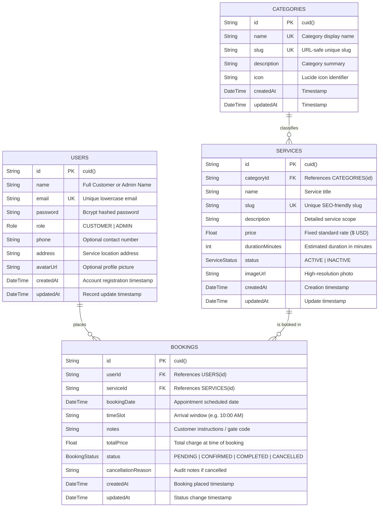

# ServiceHub Database Architecture & Entity Relationship Diagram (ERD)

## 1. Relational Database Overview

The ServiceHub database schema is built using **Prisma ORM** targeting relational **PostgreSQL** (and compatible with SQLite in local test environments). It models the complete lifecycle of customer accounts, service offerings, categorical groupings, and appointment bookings.

---

## 2. Mermaid Entity-Relationship Diagram

---

## 3. Detailed Data Dictionary

### Table: `User`
| Column | Type | Constraints | Description |
|---|---|---|---|
| `id` | `VARCHAR(30)` | PRIMARY KEY | Unique identifier (CUID) |
| `name` | `VARCHAR(100)` | NOT NULL | User's full name |
| `email` | `VARCHAR(120)` | UNIQUE, NOT NULL | Normalized lowercase email address |
| `password` | `VARCHAR(255)` | NOT NULL | Salted bcrypt hash ($2a$10$...) |
| `role` | `ENUM` | NOT NULL, DEFAULT `'CUSTOMER'` | Access role: `CUSTOMER` or `ADMIN` |
| `phone` | `VARCHAR(30)` | NULLABLE | Contact telephone |
| `address` | `VARCHAR(255)` | NULLABLE | Primary residential or business address |
| `avatarUrl` | `VARCHAR(500)` | NULLABLE | Profile avatar image link |
| `createdAt`| `TIMESTAMP` | NOT NULL, DEFAULT `NOW()` | Timestamp of registration |
| `updatedAt`| `TIMESTAMP` | NOT NULL, UPDATED | Timestamp of last modification |

### Table: `Category`
| Column | Type | Constraints | Description |
|---|---|---|---|
| `id` | `VARCHAR(30)` | PRIMARY KEY | Unique identifier (CUID) |
| `name` | `VARCHAR(80)` | UNIQUE, NOT NULL | Distinct category title |
| `slug` | `VARCHAR(80)` | UNIQUE, NOT NULL | URL-safe hyphenated identifier |
| `description`| `VARCHAR(500)` | NULLABLE | Summary of services in category |
| `icon` | `VARCHAR(50)` | NULLABLE | Lucide icon identifier string |
| `createdAt`| `TIMESTAMP` | NOT NULL, DEFAULT `NOW()` | Timestamp created |
| `updatedAt`| `TIMESTAMP` | NOT NULL, UPDATED | Timestamp updated |

### Table: `Service`
| Column | Type | Constraints | Description |
|---|---|---|---|
| `id` | `VARCHAR(30)` | PRIMARY KEY | Unique identifier (CUID) |
| `categoryId`| `VARCHAR(30)` | FOREIGN KEY, NOT NULL | References `Category(id)` with CASCADE |
| `name` | `VARCHAR(120)`| NOT NULL | Display name of service |
| `slug` | `VARCHAR(140)`| UNIQUE, NOT NULL | SEO URL slug |
| `description`| `TEXT` | NOT NULL | Full service specifications & terms |
| `price` | `DOUBLE PRECISION`| NOT NULL | Fixed booking rate ($ USD) |
| `durationMinutes`| `INT` | NOT NULL, DEFAULT `60` | Estimated service time in minutes |
| `status` | `ENUM` | NOT NULL, DEFAULT `'ACTIVE'` | Visibility state: `ACTIVE` or `INACTIVE` |
| `imageUrl` | `VARCHAR(500)` | NULLABLE | Cover image CDN link |
| `createdAt`| `TIMESTAMP` | NOT NULL, DEFAULT `NOW()` | Timestamp created |
| `updatedAt`| `TIMESTAMP` | NOT NULL, UPDATED | Timestamp updated |

### Table: `Booking`
| Column | Type | Constraints | Description |
|---|---|---|---|
| `id` | `VARCHAR(30)` | PRIMARY KEY | Unique identifier (CUID) |
| `userId` | `VARCHAR(30)` | FOREIGN KEY, NOT NULL | References `User(id)` with CASCADE |
| `serviceId`| `VARCHAR(30)` | FOREIGN KEY, NOT NULL | References `Service(id)` with CASCADE |
| `bookingDate`| `DATE / TIMESTAMP`| NOT NULL | Scheduled appointment date |
| `timeSlot` | `VARCHAR(30)` | NOT NULL | Time slot (e.g. "10:00 AM") |
| `notes` | `TEXT` | NULLABLE | Customer notes or instructions |
| `totalPrice`| `DOUBLE PRECISION`| NOT NULL | Locked price snapshot at checkout |
| `status` | `ENUM` | NOT NULL, DEFAULT `'PENDING'` | `PENDING`, `CONFIRMED`, `COMPLETED`, `CANCELLED` |
| `cancellationReason`| `TEXT` | NULLABLE | Reason recorded if cancelled |
| `createdAt`| `TIMESTAMP` | NOT NULL, DEFAULT `NOW()` | Placed timestamp |
| `updatedAt`| `TIMESTAMP` | NOT NULL, UPDATED | Status transition timestamp |

---

## 4. Integrity Constraints & Business Logic

1. **Foreign Key Deletion Rules**: `ON DELETE CASCADE` is set on categories and services to maintain referential integrity.
2. **Double-Booking Prevention**: Composite index and query guard on `(userId, serviceId, bookingDate, timeSlot)` preventing overlapping active bookings.
3. **State Machine Integrity**:
   - `PENDING` $\to$ `CONFIRMED` or `CANCELLED`
   - `CONFIRMED` $\to$ `COMPLETED` or `CANCELLED`
   - `COMPLETED` $\to$ Terminal state (immutable)
   - `CANCELLED` $\to$ Terminal state (immutable)
